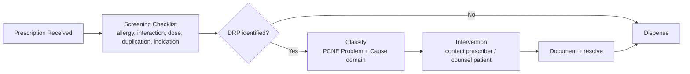

# Pharmacy Dispensing & Medication Safety QC

**A drug-related problem (DRP) screening and documentation framework for pharmacy dispensing, built on PCNE's clinical classification standard.**

> Portfolio case study built entirely on invented, synthetic scenarios. No real patient, prescriber, or pharmacy data appears anywhere — every screening record here is a fictional example designed to illustrate the framework.

## The problem

Dispensing pharmacists catch drug-related problems — interactions, dosing errors, therapeutic duplication — but often informally and inconsistently, with no structured screening step and no documentation trail. Patterns that would be obvious in aggregate (which interaction type keeps recurring, which prescriber needs a nudge) never surface, because nothing gets logged in a form that can be reviewed later.

**Goal:** build a structured, standards-based DRP screening and documentation framework that sits inside the dispensing workflow itself, so problems are caught and classified before medication reaches the patient, not discovered after.

## Pipeline

## Reproducible standards

The classification logic lives in [`Pharmacy-DRP-Screening-Guide.md`](Pharmacy-DRP-Screening-Guide.md) — built on the Pharmaceutical Care Network Europe (PCNE) Drug-Related Problem classification (V9.1), the internationally used standard that separates *what went wrong* (the problem) from *why* (the cause), rather than lumping both together as a single "medication error."

## Quality control

[`Pharmacy-DRP-Log.xlsx`](Pharmacy-DRP-Log.xlsx) is a 28-record screening sample — 24 DRPs identified, 4 clean — with three tabs:

- **DRP Log** — the record-by-record trail: problem domain, cause, severity, intervention, and outcome
- **DRP Summary** — formula-driven counts by severity, PCNE problem domain, and cause category, plus a chart
- **Screening Checklist** — the point-of-dispensing form a pharmacist completes before dispensing, not after

**What this sample surfaces:** 17 of 24 DRPs (71%) fall under Treatment Safety rather than Treatment Effectiveness — consistent with a screening step tuned specifically to catch interactions, allergy conflicts, and dosing errors before they reach a patient. The single leading cause is inappropriate dosing (5 of 24), narrowly ahead of drug interactions and untreated indications (4 each) — exactly the kind of finding that argues for a dedicated dose-check step rather than folding it into one general review.

## Implementation

In Kenya specifically, this kind of dispensing-QC step lines up with the Pharmacy and Poisons Board's Guidelines for Good Pharmacy Practice (2024), which set out dispensing standards and KPIs as part of pharmacy licensing and oversight under the Pharmacy and Poisons Act (Cap 244) — this framework is designed to slot into that existing structure rather than sit alongside it as extra paperwork.

## Impact

| | Before | With this framework |
|---|---|---|
| DRP documentation | Informal, inconsistent, rarely logged | Every screening logged, classified, and tracked to resolution |
| Pattern visibility | Not visible — no aggregation | Formula-driven summary surfaces the leading problem/cause each period |
| Intervention trail | Undocumented | Every prescriber contact and patient counseling note is on record |

## Files in this project

- `Pharmacy-README.md` — this file (rename to `README.md` at the repo root)
- `Pharmacy-DRP-Screening-Guide.md` — the PCNE-based classification standard
- `Pharmacy-DRP-Log.xlsx` — DRP log, summary + chart, and the point-of-dispensing checklist

---

**Author:** Ezra Kessem — BPharm, clinical pharmacy documentation & QC
